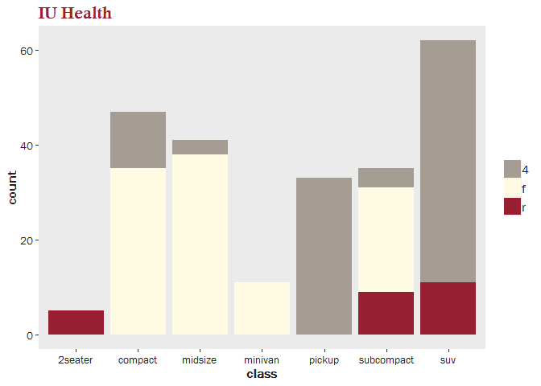

[](https://travis-ci.org/NateByers/IUHhelpers)
[](http://codecov.io/github/NateByers/IUHhelpers?branch=master)

Helper functions for doing data analysis at  IU Health.

## Installation

Install from GitHub using `devtools`.


```r
if(!require(devtools)) {
  install.packages("devtools")
}
devtools::install_github("NateByers/IUHhelpers")

library(IUHhelpers)
```


## Match MRNs

Match people from two different EMRs.


```r
data(x_EMR)
data(y_EMR)
 
match_MRNs(x_EMR, y_EMR)
```

```
##   mrn_x first_name_x last_name_x birth_date_x mrn_y first_name_y
## 1    11        James       Brown   1978-01-01    21        James
## 2    12      Charlie      Manson   1952-05-15    22      Charles
## 3    14         Gary      Oldman   1960-12-15    24         Gary
## 4    15        Steve       Brown   1980-01-01    25      Stephen
## 5    17         Phil      Bowers   1980-01-01    27       Philip
##   last_name_y birth_date_y dist
## 1       Brown   1978-01-01    0
## 2      Manson   1952-05-15    2
## 3     Old-man   1960-12-15    0
## 4       Brown   1980-01-01    3
## 5   Bowers Jr   1980-01-01    2
```

## IU Health Theme

Add an IU Health theme to your `ggplot2` graph.


```r
library(ggplot2)

ggplot(mpg, aes(class, fill = drv)) + geom_bar() + theme_iuh() + 
  scale_fill_iuh() + ggtitle("IU Health")
```

<!-- -->

Use IU Health fonts.


```r
library(extrafont)

# it will take a few minutes to import fonts from your operating system
font_import(prompt = FALSE)
loadfonts(quiet = TRUE)

ggplot(mpg, aes(class, fill = drv)) + geom_bar() + theme_iuh() + 
  scale_fill_iuh() + ggtitle("IU Health")
```

<!-- -->

## Correlated variables

Find groups of correlated variables.


```r
corr_groups(mtcars)
```

```
## $`1`
## [1] "disp" "cyl"
```

```r
corr_groups(mtcars, cutoff = 0.75)
```

```
## $`1`
## [1] "disp" "hp"   "wt"   "cyl" 
## 
## $`2`
## [1] "gear" "am"
```

```r
corr_groups(mtcars, cutoff = 0.75, cor_mat = TRUE)
```

```
## $`1`
##           disp        hp        wt       cyl
## disp 1.0000000 0.7909486 0.8879799 0.9020329
## hp   0.7909486 1.0000000 0.6587479 0.8324475
## wt   0.8879799 0.6587479 1.0000000 0.7824958
## cyl  0.9020329 0.8324475 0.7824958 1.0000000
## 
## $`2`
##           gear        am
## gear 1.0000000 0.7940588
## am   0.7940588 1.0000000
```

## ICD categories

Add a column of categories to a data.frame of ICD codes


```r
x <- data.frame(icd = c("43852", "M93929", "W002XXA"))

add_icd_category(icd = x, icd_column = "icd")
```

```
##       icd global_short_description
## 1   43852             Late eff CVD
## 2  M93929               Ot bone dx
## 3 W002XXA            E Codes: Fall
```

## Cleanup headers

Transform column names to work nicely as data.frame headers.


```r
column_names <- c("MRN ID", "First & Middle Name", "Name: Last")

cleanup_headers(column_names)
```

```
## [1] "MRN_ID"                "First_and_Middle_Name" "Name_Last"
```
